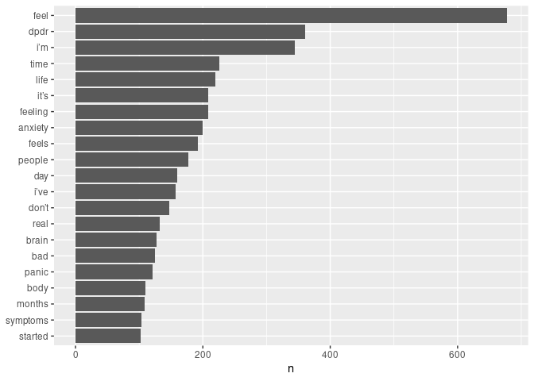
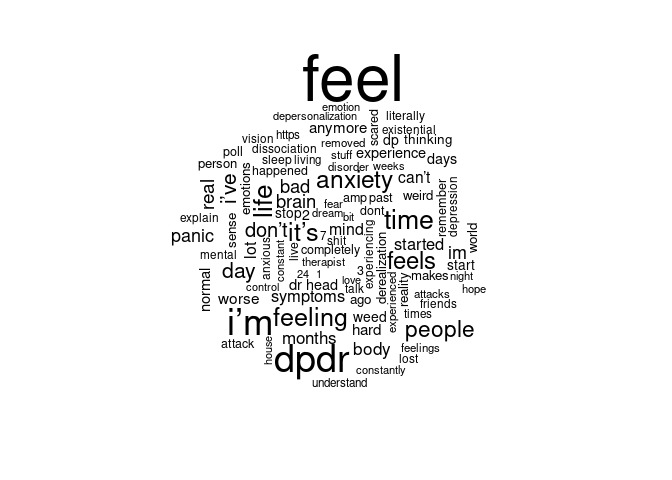
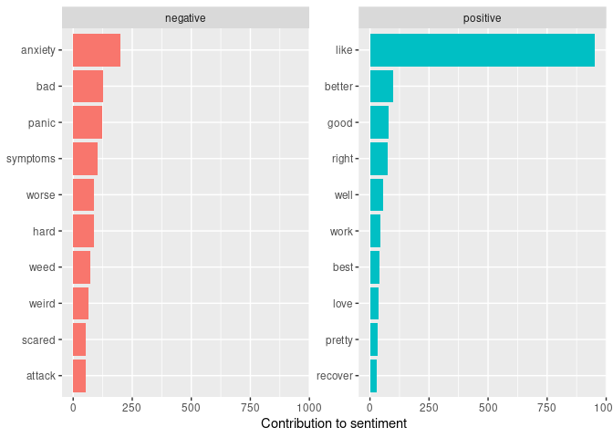
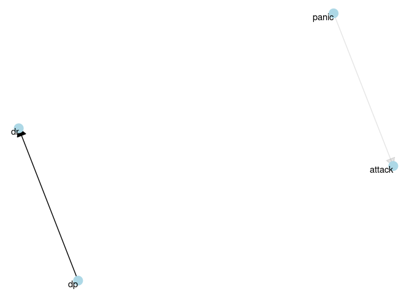

# Section 1: Exploratory Analysis of Keywords in Forums on Dissociation
2022-03-25

##### Description of raw data:

-   Webscraped using PRAW, Reddit’s API
-   From forum about depersonalization/derealization.
-   Contains post title, post content, post date
-   Data date range: 2022-03-01 to 2022-03-27

#### Most commonly used words:

<!-- --><!-- -->

#### Most common positive and negative words:

<!-- -->

#### Relationships between words: n-grams and correlations

##### Visualizing a network of bigrams:

<!-- -->

##### Centrality of Words

    ## Warning in graph_from_data_frame(x, directed = directed): In `d' `NA' elements
    ## were replaced with string "NA"

    ## Warning: ggrepel: 140 unlabeled data points (too many overlaps). Consider
    ## increasing max.overlaps

<!-- -->


# Section 2: Topic Modeling with BERT and TF-IDF
2022-07-20

```python
# https://towardsdatascience.com/topic-modeling-with-bert-779f7db187e6
```

```python
#!pip install bertopic
```


```python
import pandas as pd

# Reading file from local storage
file_location = r'/home/jls/JN/dpdr.csv'
file_type = "csv"

dfs = pd.read_csv(file_location)
doc = dfs.loc[:,"post"]
print(doc)
#df.count()
```

    0       LolThere is no way out of this , I have offici...
    1       I’m afraid I’ve been dealing with a 5 day long...
    2       If you have tension in your head, does it feel...
    3       Parnate and lamotrigineHey everyone,\n\nI just...
    4       Short discussion of the film "Numb" which is t...
                                  ...                        
    3631                          r/dpdr Subdirect Statistics
    3632    COVID and DPDR(not here to argue about vaccina...
    3633    Relief after 5 months. Ask me anything:)Finall...
    3634    It's so intense that I feel like I don't even ...
    3635    Anyone tried l tyrosine?I’ve heard that’s a go...
    Name: post, Length: 3636, dtype: object


```python
from sentence_transformers import SentenceTransformer
model = SentenceTransformer('distilbert-base-nli-mean-tokens')
embeddings = model.encode(doc, show_progress_bar=True)
```


    Batches:   0%|          | 0/114 [00:00<?, ?it/s]


```python
import umap
umap_embeddings = umap.UMAP(n_neighbors=15, 
                            n_components=5, 
                            metric='cosine').fit_transform(embeddings)
```


```python
import hdbscan
cluster = hdbscan.HDBSCAN(min_cluster_size=15,
                          metric='euclidean',                      
                          cluster_selection_method='eom').fit(umap_embeddings)
```


```python
import matplotlib.pyplot as plt

# Prepare data
umap_data = umap.UMAP(n_neighbors=15, n_components=2, min_dist=0.0, metric='cosine').fit_transform(embeddings)
result = pd.DataFrame(umap_data, columns=['x', 'y'])
result['labels'] = cluster.labels_

# Visualize clusters
fig, ax = plt.subplots(figsize=(20, 10))
outliers = result.loc[result.labels == -1, :]
clustered = result.loc[result.labels != -1, :]
plt.scatter(outliers.x, outliers.y, color='#BDBDBD', s=1)
plt.scatter(clustered.x, clustered.y, c=clustered.labels, s=1, cmap='hsv_r')
plt.colorbar()
```


    
<!-- -->


```python
docs_df = doc.to_frame().rename(columns = {'post':'Doc'})
docs_df['Topic'] = cluster.labels_
docs_df['Doc_ID'] = range(len(docs_df))
docs_df
docs_per_topic = docs_df.groupby(['Topic'], as_index = False).agg({'Doc': ' '.join})
```


```python
import numpy as np
from sklearn.feature_extraction.text import CountVectorizer

def c_tf_idf(documents, m, ngram_range=(1, 1)):
    count = CountVectorizer(ngram_range=ngram_range, stop_words="english").fit(documents)
    t = count.transform(documents).toarray()
    w = t.sum(axis=1)
    tf = np.divide(t.T, w)
    sum_t = t.sum(axis=0)
    idf = np.log(np.divide(m, sum_t)).reshape(-1, 1)
    tf_idf = np.multiply(tf, idf)

    return tf_idf, count
  
tf_idf, count = c_tf_idf(docs_per_topic.Doc.values, m=len(doc))
```


```python
def extract_top_n_words_per_topic(tf_idf, count, docs_per_topic, n=20):
    words = count.get_feature_names()
    labels = list(docs_per_topic.Topic)
    tf_idf_transposed = tf_idf.T
    indices = tf_idf_transposed.argsort()[:, -n:]
    top_n_words = {label: [(words[j], tf_idf_transposed[i][j]) for j in indices[i]][::-1] for i, label in enumerate(labels)}
    return top_n_words

def extract_topic_sizes(df):
    topic_sizes = (df.groupby(['Topic'])
                     .Doc
                     .count()
                     .reset_index()
                     .rename({"Topic": "Topic", "Doc": "Size"}, axis='columns')
                     .sort_values("Size", ascending=False))
    return topic_sizes

top_n_words = extract_top_n_words_per_topic(tf_idf, count, docs_per_topic, n=20)
topic_sizes = extract_topic_sizes(docs_df); topic_sizes.head(10)
```

```python
top_n_words[0][:10]
```


    [('really', 0.007758313612847956),
     ('feeling', 0.007749180482272903),
     ('know', 0.007713640753396208),
     ('ve', 0.007476064080397414),
     ('think', 0.007466554247109187),
     ('time', 0.007440581170049944),
     ('life', 0.0074352045216576805),
     ('felt', 0.007325839413153062),
     ('feels', 0.007263618785323988),
     ('don', 0.007243585572851497)]


```python
top_n_words[1][:10]
```


    [('poll', 0.27884752064544444),
     ('www', 0.17575169562801965),
     ('view', 0.16821173441824555),
     ('com', 0.16627149629544336),
     ('reddit', 0.16545962703344716),
     ('https', 0.16530972633780874),
     ('donate', 0.01729449223848627),
     ('nlm', 0.016815957968685864),
     ('ncbi', 0.016815957968685864),
     ('nih', 0.016411363008509334)]


# Section 3: Topic Modeling with SparkNLP tf-idf LDA
2022-07-26

```python
# https://github.com/maobedkova/TopicModelling_PySpark_SparkNLP/blob/master/Topic_Modelling_with_PySpark_and_Spark_NLP.ipynb
```


```python
# Import Spark NLP and initialize session

import sparknlp

spark = sparknlp.start()
print("Spark NLP version: ", sparknlp.version())
print("Apache Spark version: ", spark.version)
```


    Spark NLP version:  4.0.2
    Apache Spark version:  3.3.0


```python
import pandas as pd
import gc
from pyspark.sql import functions as F

path = '/home/jls/JN/dpdr.csv'
data = spark.read.csv(path, header=True)

text_col = 'post'
df = data.select(text_col).filter(F.col(text_col).isNotNull())
del data
gc.collect()

df.limit(5).show(truncate=90)
```

                                                                                    

    +------------------------------------------------------------------------------------------+
    |                                                                                      post|
    +------------------------------------------------------------------------------------------+
    |                                LolThere is no way out of this , I have officially lost it|
    |I’m afraid I’ve been dealing with a 5 day long severe dissociative episode.I’m 15, and ...|
    |                                      If you have tension in your head, does it feel like:|
    |                                                      Parnate and lamotrigineHey everyone,|
    |"Short discussion of the film ""Numb"" which is the only pop culture focused on deperso...|
    +------------------------------------------------------------------------------------------+
    


```python
from sparknlp.base import *
from sparknlp.annotator import *

document_assembler = DocumentAssembler() \
    .setInputCol("post") \
    .setOutputCol("document") \
    .setCleanupMode("shrink")

tokenizer = Tokenizer() \
  .setInputCols(["document"]) \
  .setOutputCol("tokenized")

normalizer = Normalizer() \
     .setInputCols(['tokenized']) \
     .setOutputCol('normalized') \
     .setLowercase(True)

lemmatizer = LemmatizerModel.pretrained() \
     .setInputCols(['normalized']) \
     .setOutputCol('lemmatized')

stopwords_cleaner = StopWordsCleaner()\
      .setInputCols(['lemmatized'])\
      .setOutputCol('unigrams')\
      .setCaseSensitive(False)\

ngrammer = NGramGenerator() \
    .setInputCols(['lemmatized']) \
    .setOutputCol('ngrams') \
    .setN(3) \
    .setEnableCumulative(True) \
    .setDelimiter('_')

pos_tagger = PerceptronModel.pretrained('pos_anc') \
    .setInputCols(['document', 'lemmatized']) \
    .setOutputCol('pos')

finisher = Finisher() \
     .setInputCols(['unigrams', 'ngrams', 'pos'])

from pyspark.ml import Pipeline
pipeline = Pipeline() \
    .setStages([document_assembler, 
            tokenizer,
            normalizer,
            lemmatizer,
            stopwords_cleaner, 
            ngrammer,
            pos_tagger,
            finisher])
```

    lemma_antbnc download started this may take some time.
    Approximate size to download 907.6 KB
    [ | ]lemma_antbnc download started this may take some time.
    Approximate size to download 907.6 KB
    Download done! Loading the resource.
    [ / ]

                                                                                    

    [OK!]
    pos_anc download started this may take some time.
    Approximate size to download 3.9 MB
    [ | ]pos_anc download started this may take some time.
    Approximate size to download 3.9 MB
    [ / ]Download done! Loading the resource.


    [Stage 7:====================================================>    (11 + 1) / 12]

    [ — ]

                                                                                    

    [OK!]


```python
# train the pipeline

nlpModel = pipeline.fit(df).transform(df)
gc.collect()
nlpModel.show(5)
```

    WARNING: An illegal reflective access operation has occurred
    WARNING: Illegal reflective access by org.apache.spark.util.SizeEstimator$ (file:/home/jls/anaconda3/lib/python3.9/site-packages/pyspark/jars/spark-core_2.12-3.3.0.jar) to field java.util.regex.Pattern.pattern
    WARNING: Please consider reporting this to the maintainers of org.apache.spark.util.SizeEstimator$
    WARNING: Use --illegal-access=warn to enable warnings of further illegal reflective access operations
    WARNING: All illegal access operations will be denied in a future release
    [Stage 8:>                                                          (0 + 1) / 1]

    +--------------------+--------------------+--------------------+--------------------+
    |                post|   finished_unigrams|     finished_ngrams|        finished_pos|
    +--------------------+--------------------+--------------------+--------------------+
    |LolThere is no wa...|[lolthere, way, o...|[lolthere, be, no...|[RB, VB, DT, NN, ...|
    |I’m afraid I’ve b...|[im, afraid, ive,...|[im, afraid, ive,...|[NN, JJ, JJ, VB, ...|
    |If you have tensi...|[tension, head, f...|[if, you, have, t...|[IN, PRP, VBP, NN...|
    |Parnate and lamot...|[parnate, lamotri...|[parnate, and, la...|    [NN, CC, NN, NN]|
    |"Short discussion...|[short, discussio...|[short, discussio...|[JJ, NN, IN, DT, ...|
    +--------------------+--------------------+--------------------+--------------------+
    only showing top 5 rows
    


                                                                                    


```python
from pyspark.sql import types as T

udf_join_arr = F.udf(lambda x: ' '.join(x), T.StringType())
nlpModel  = nlpModel.withColumn('finished_pos', udf_join_arr(F.col('finished_pos')))
nlpModel.columns
```


    ['post', 'finished_unigrams', 'finished_ngrams', 'finished_pos']


```python
#second spark nlp pipeline: correspond POS tag ngrams w/ word ngrams

pos_documentAssembler = DocumentAssembler() \
     .setInputCol('finished_pos') \
     .setOutputCol('pos_document')

pos_tokenizer = Tokenizer() \
     .setInputCols(['pos_document']) \
     .setOutputCol('pos')

pos_ngrammer = NGramGenerator() \
    .setInputCols(['pos']) \
    .setOutputCol('pos_ngrams') \
    .setN(3) \
    .setEnableCumulative(True) \
    .setDelimiter('_')

pos_finisher = Finisher() \
     .setInputCols(['pos', 'pos_ngrams']) \

pos_pipeline = Pipeline() \
     .setStages([pos_documentAssembler,                  
                 pos_tokenizer,
                 pos_ngrammer,  
                 pos_finisher])
```


```python
nlpModel = pos_pipeline.fit(nlpModel).transform(nlpModel)
gc.collect()
nlpModel.columns
```


    ['post',
     'finished_unigrams',
     'finished_ngrams',
     'finished_pos',
     'finished_pos_ngrams']


```python
#filter for useful POS tags for unigrams
def filter_pos(words, pos_tags):
    return [word for word, pos in zip(words, pos_tags) 
            if pos in ['JJ', 'NN', 'NNS', 'VB', 'VBP']]

udf_filter_pos = F.udf(filter_pos, T.ArrayType(T.StringType()))

nlpModel = nlpModel.withColumn('filtered_unigrams',
                udf_filter_pos(F.col('finished_unigrams'),
                               F.col('finished_pos')))
```


```python
nlpModel.select('filtered_unigrams').limit(5).show(truncate = 90)
```

    [Stage 9:>                                                          (0 + 1) / 1]

    +------------------------------------------------------------------------------------------+
    |                                                                         filtered_unigrams|
    +------------------------------------------------------------------------------------------+
    |                                                                               [way, lose]|
    |[im, afraid, ive, deal, day, dissociative, episodeim, far, ive, never, scary, relate, w...|
    |                                                                              [feel, like]|
    |                                                                       [parnate, everyone]|
    |[short, discussion, pop, culture, depersonalization, aware, ofits, film, star, perry, h...|
    +------------------------------------------------------------------------------------------+
    


                                                                                    


```python
#filter for useful POS combos of ngrams
def filter_pos_combs(words, pos_tags):
    return [word for word, pos in zip(words, pos_tags) 
            if (len(pos.split('_')) == 2 and \
                pos.split('_')[0] in ['JJ', 'NN', 'NNS', 'VB', 'VBP'] and \
                 pos.split('_')[1] in ['JJ', 'NN', 'NNS']) \
            or (len(pos.split('_')) == 3 and \
                pos.split('_')[0] in ['JJ', 'NN', 'NNS', 'VB', 'VBP'] and \
                 pos.split('_')[1] in ['JJ', 'NN', 'NNS', 'VB', 'VBP'] and \
                  pos.split('_')[2] in ['NN', 'NNS'])]
    
udf_filter_pos_combs = F.udf(filter_pos_combs, T.ArrayType(T.StringType()))

nlpModel = nlpModel.withColumn('filtered_ngrams',
                        udf_filter_pos_combs(F.col('finished_ngrams'),
                                    F.col('finished_pos_ngrams')))

gc.collect()

nlpModel.select('filtered_ngrams').limit(5).show(truncate = 90)
```

    [Stage 12:>                                                         (0 + 1) / 1]

    +------------------------------------------------------------------------------------------+
    |                                                                           filtered_ngrams|
    +------------------------------------------------------------------------------------------+
    |                                                                                        []|
    |[im_afraid, afraid_ive, be_deal, day_long, long_severe, severe_dissociative, dissociati...|
    |                                                                            [have_tension]|
    |                                                                 [lamotriginehey_everyone]|
    |[short_discussion, film_numb, only_pop, pop_culture, culture_focus, depersonalization_i...|
    +------------------------------------------------------------------------------------------+
    


                                                                                    


```python
from pyspark.sql.functions import concat

processed_review = nlpModel.withColumn('final', 
                            concat(F.col('filtered_unigrams'), 
                                    F.col('filtered_ngrams')))
processed_review.select('final').limit(5).show(truncate=90)
processed_review.columns

processed_review.toPandas().to_csv('preprocessed xgrams.csv')
```

                                                                                    

    +------------------------------------------------------------------------------------------+
    |                                                                                     final|
    +------------------------------------------------------------------------------------------+
    |                                                                               [way, lose]|
    |[im, afraid, ive, deal, day, dissociative, episodeim, far, ive, never, scary, relate, w...|
    |                                                                [feel, like, have_tension]|
    |                                              [parnate, everyone, lamotriginehey_everyone]|
    |[short, discussion, pop, culture, depersonalization, aware, ofits, film, star, perry, h...|
    +------------------------------------------------------------------------------------------+
    


                                                                                    


```python
#VECTORIZATION -> Term Frequency Inverse Document Frequency

from pyspark.ml.feature import CountVectorizer
tfizer = CountVectorizer(inputCol='final', outputCol='tf_features')
tf_model = tfizer.fit(processed_review)
tf_result = tf_model.transform(processed_review)

from pyspark.ml.feature import IDF
idfizer = IDF(inputCol='tf_features', outputCol='tf_idf_features')
idf_model = idfizer.fit(tf_result)
tfidf_result = idf_model.transform(tf_result)
tfidf_result.columns
```

                                                                                    


    ['post',
     'finished_unigrams',
     'finished_ngrams',
     'finished_pos',
     'finished_pos_ngrams',
     'filtered_unigrams',
     'filtered_ngrams',
     'final',
     'tf_features',
     'tf_idf_features']


```python
tfidf_result.toPandas().to_csv('TF-IDF Results.csv')
```

    22/07/25 23:56:58 WARN DAGScheduler: Broadcasting large task binary with size 1195.4 KiB


                                                                                    


```python
num = [ x for x in range(1, 30) if x % 2 == 0]
num
```


    [2, 4, 6, 8, 10, 12, 14, 16, 18, 20, 22, 24, 26, 28]


```python
#Find optimal number of topics   
from tqdm.notebook import tqdm, trange
from time import sleep
from pyspark.ml.clustering import LDA

max_iter = 10
perplex = []
loglike = []
for i in tqdm(num):
    num_topics = i
    lda = LDA(k=num_topics, maxIter=max_iter, featuresCol='tf_idf_features')
    lda_model = lda.fit(tfidf_result)
    ll = lda_model.logLikelihood(tfidf_result)
    lp = lda_model.logPerplexity(tfidf_result)
    loglike.append(ll)
    perplex.append(lp)
    sleep(0.01)
```


      0%|          | 0/14 [00:00<?, ?it/s]


```python
import matplotlib.pyplot as plt
plt.plot(num,perplex, marker='o')
plt.title('upper bound on perplexity', fontsize=14)
plt.xlabel('numTopics', fontsize=14)
plt.grid(True)
plt.show()
```


    

    


```python
plt.plot(num,loglike, marker='o')
plt.title("lower bound on the log likelihood", fontsize=14)
plt.xlabel('NumTopics', fontsize=14)
plt.grid(True)
plt.show()
```


    

    


```python
#LDA
lda = LDA(k=7, maxIter=10, featuresCol='tf_idf_features')
lda_model = lda.fit(tfidf_result)
```
                                                                                    


```python
vocab = tf_model.vocabulary

topics = lda_model.describeTopics()   
topics_rdd = topics.rdd

topics_words = topics_rdd\
       .map(lambda row: row['termIndices'])\
       .map(lambda idx_list: [vocab[idx] for idx in idx_list])\
       .collect()

for idx, topic in enumerate(topics_words):
    print("topic: {}".format(idx))
    print("*"*25)
    for word in topic:
       print(word)
    print("*"*25)
```

    topic: 0
    *************************
    dpdr
    feel
    im
    recover
    come
    even
    weed
    dont
    love
    didnt
    *************************
    topic: 1
    *************************
    low
    gt
    same_time
    miss
    vision
    gt_panic
    loss
    eye
    couple
    thing
    *************************
    topic: 2
    *************************
    know
    feel
    alone
    existential
    like
    way
    say
    get_dpdr
    smoke
    really
    *************************
    topic: 3
    *************************
    like
    feel
    relate
    anyone
    help
    visual
    detach
    go
    care
    appreciate
    *************************
    topic: 4
    *************************
    like
    feel
    look
    dont
    im
    thoughts
    remember
    sleep
    seem
    anyone
    *************************
    topic: 5
    *************************
    feel
    cause
    trauma
    dpdr
    well
    start
    long
    wonder
    anyone
    use
    *************************
    topic: 6
    *************************
    feel
    im
    like
    get
    go
    dpdr
    bad
    cant
    thing
    ive
    *************************

