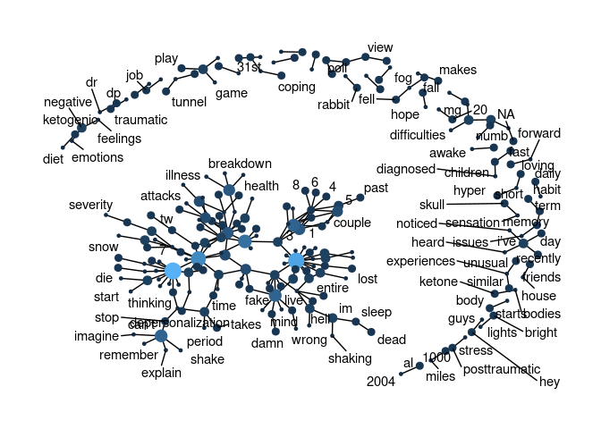
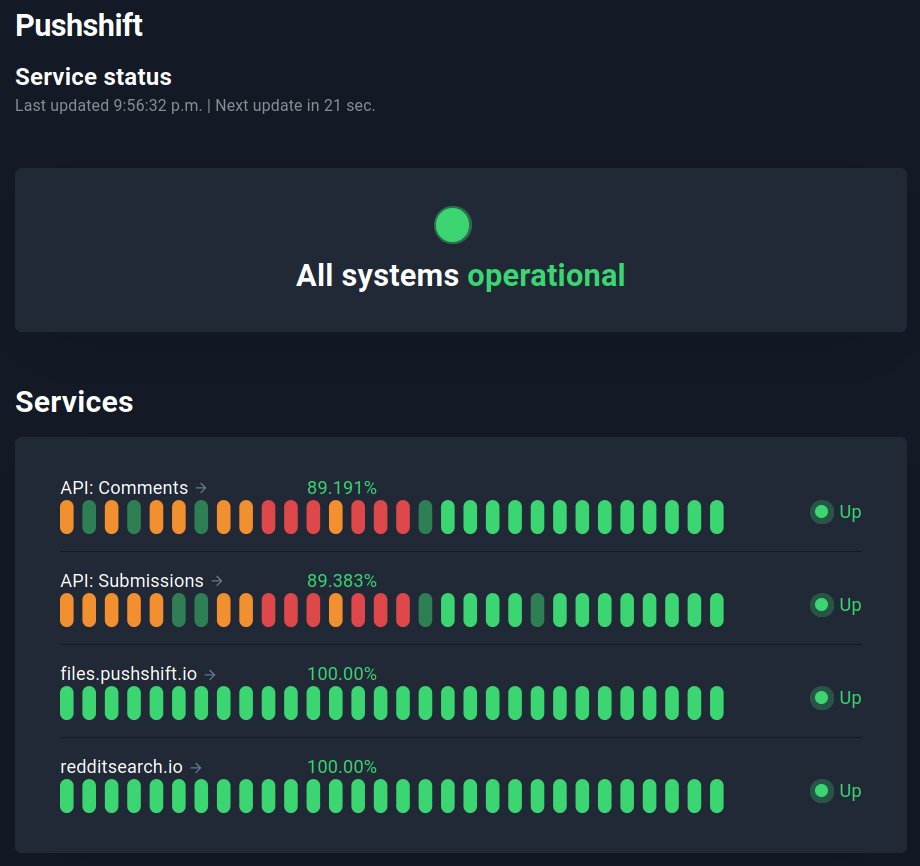
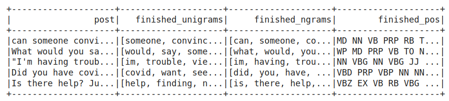
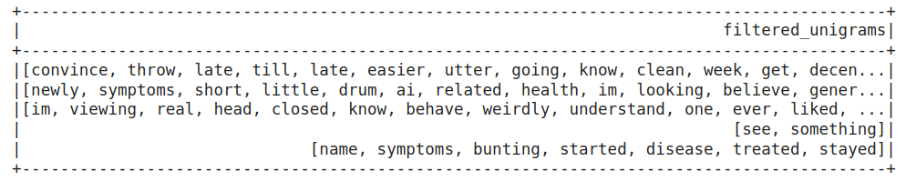
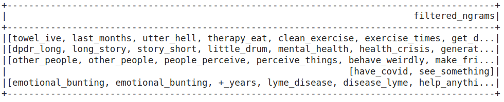
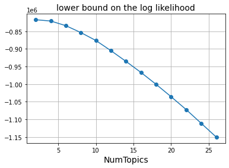
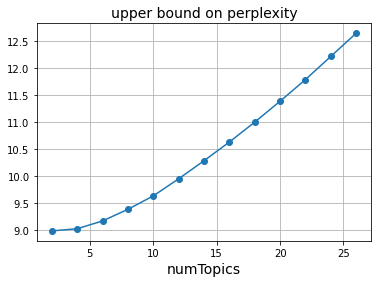
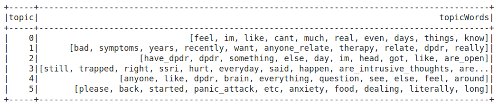

# Section 1: Exploratory Analysis of Keywords in Forums on Dissociation
2022-03-25

## Description of raw data:

-   Webscraped using PRAW, Reddit’s API
-   From forum about depersonalization/derealization.
-   Contains post title, post content, post date
-   Data date range: 2022-03-01 to 2022-03-27

## Most commonly used words:

<!-- --><!-- -->


## Most common positive and negative words:

<!-- -->

## Relationships between words: n-grams and correlations

### Visualizing a network of bigrams:

<!-- -->

## Centrality of Words

    ## Warning in graph_from_data_frame(x, directed = directed): In `d' `NA' elements
    ## were replaced with string "NA"

    ## Warning: ggrepel: 140 unlabeled data points (too many overlaps). Consider
    ## increasing max.overlaps

<!-- -->

# Section 2: Topic Modeling with TF-IDF and LDA
> Large segments of code were adapted from Obedkova's (2020) tutorial, namely in the following sections: SparkNLP Pipelines, PoS-based Filtering, and Vectorization.

## Dependencies: 
``` python
# Install pyspark
! pip install pyspark==3.3.0
! apt-get install openjdk-8-jdk-headless -qq > /dev/null

# Install Spark NLP
! pip install spark-nlp==4.0.2

# Install nltk
! pip install nltk
```

## Import SparkNLP and initialize session
``` python
import sparknlp

spark = sparknlp.start()
print("Spark NLP version: ", sparknlp.version())
print("Apache Spark version: ", spark.version)
```
Spark NLP version: 4.0.2

Apache Spark version: 3.30

## Data
A csv file containing webscraped data from Reddit's r/DPDR is imported. To see the webscraping code, click to view the file **Webscraping for Datasets.ipynb**.

A popular and easy way to retrieve data from Reddit is through the [**PushShift.io**](https://reddit-api.readthedocs.io/en/latest/) API Wrapper [**PMAW**](https://github.com/mattpodolak/pmaw), [**PSAW**](https://psaw.readthedocs.io/en/latest/), or [**PRAW**](https://praw.readthedocs.io/en/stable/). Unfortunately, many attempts at using them produced questionable results - many post submissions were missing within specified timeframes, as well as producing numerous duplicates of ones that were retrieved. The former has been confirmed by Elizaveta Sivak's article within the Summer Institute in Computational Social Science website, as seen [**here**](https://sicss.io/2021/materials/hse/reddit_.html). These wrappers do not have access to posts in certain timeframes.

As a result, the more manual use of PushShift.io itself is utilized, due to its 100% operational status as seen [here](https://stats.uptimerobot.com/l8RZDu1gBG). Here is a screenshot taken on Jan 17, 2023:
<!-- -->

However, there are still some limitations:
1. Reddit's PushShift.io fundamentally limits each post retrieval amount to 1000.
2. There was some difficulty in troubleshooting the use of specific timeframes, i.e., between date1 to date2. 

Thus, temporarily for now, the current dataset is described as the following:
- n = 1000 post submissions from r/DPDR
- sorted by submission date in descending order, starting from January 15, 2023

Here is a glimpse of the dataset:
<!-- -->

## SparkNLP Pipelines
### No.1: Unigrams & PoS
First, a basic pipeline is used to transform the data into unigrams and their respective Parts of Speech (PoS) labels. N-grams are also found, but may contain questionable combinations; this output will be further processed in the next pipeline.

This pipeline uses the following annotators:
1. **Document Assembler**: Prepares data into a format that is processable by Spark NLP. This is the entry point for every Spark NLP pipeline. (*Input*: the 'post' column in the current dataset.)
2. **Tokenizer**: Tokenizes raw text into word pieces, tokens. Identifies tokens with tokenization open standards. A few rules will help customizing it if defaults do not fit user needs.
3. **Normalizer**: Removes all dirty characters from text following a regex pattern and transforms words based on a provided dictionary.
4. **Stop Words Cleaner**: Takes a sequence of strings (e.g. the output of a Tokenizer, Normalizer, Lemmatizer, etc.) and drops all the stop words from the input sequences.
5. **NGram Generator**: Converts the input array of strings (annotatorType TOKEN) into an array of n-grams (annotatorType CHUNK).
6. **POSTagger**: Averaged Perceptron model to tag words part-of-speech.
7. **Finisher**: Converts annotation results into a format that easier to use. It is useful to extract the results from Spark NLP Pipelines.
> Definitions taken from the official SparkNLP website (John Snow Labs, 2021).

Contrary to commonly used NLP pipelines, a Lemmatizer Annotator is not used, in order to preserve the various uses of verb tenses. This affects generated n-grams. 

Output:
<!-- -->

### No.2: N-Grams
PoS-based filtering is used in this pipeline to remove strange word combinations and reduce vocab size.

The following pipeline is used to correspond PoS tag n-grams with word n-grams:
1. Document Assembler (*Input*: the 'finished_pos' column from the above output.)
2. Tokenizer
3. NGram Generator
4. Finisher

## PoS-based Filtering
Unigrams:
<!-- -->

Bigrams and Trigrams:
<!-- -->

## Vectorization: TF-IDF
Unigram and n-gram data as shown above are first combined. Then, **TF** (term frequency) vectorization is performed with **CountVectorizer** in PySpark. Finally, **IDF**(inverse document frequency) is used to lower word frequency scores.

## Unsupervised Topic Modeling with LDA (Latent Dirichlet Allocation)
> LDA (Blei et al., 2003) is one of the most popular topic modeling methods. Each document is made up of various words, and each topic also has various words belonging to it. The aim of LDA is to find topics a document belongs to, based on the words in it.

*Direct quotation from Kulshrestha (2020)*

When performing LDA, the number of topics is fixed and predetermined. To find the optimal number of topics, LDA models with num topics are trained and their corresponding logLikelihood and logPerplexity calculated.

 

Thus, it seems that the optimal number of topics is between 5 and 10; an eye estimated NumTopic = 6 will be utilized.

Finally, words that most embody these six topics are extracted:
<!-- -->

## Data Visualization

## References:
Obedkova, M. (2020, May). Topic Modelling with PySpark and Spark NLP. GitHub. Retrieved January 17, 2023, from https://github.com/maobedkova/TopicModelling_PySpark_SparkNLP 


Blei, D., Ng, A. Y., &amp; Jordan, M. I. (2003). Latent Dirichlet Allocation. Journal of Machine Learning, 3, 993–1022. https://doi.org/10.5555/944919.944937 

John Snow Labs. (2021, April 17). Annotators. High Performance NLP with Apache Spark. Retrieved January 17, 2023, from https://nlp.johnsnowlabs.com/docs/en/annotators 

Kulshrestha, R. (2020, September 28). Latent dirichlet allocation. Medium. Retrieved January 17, 2023, from https://towardsdatascience.com/latent-dirichlet-allocation-lda-9d1cd064ffa2 

# Section 3: Dynamic Topic Modeling with BERT --under construction
2022-12-26

> Objective: Compare topic modeling outputs based on select hyperparameters and different custom sub-models.

## Work flow:
1. Enable GPU in JupyterNotebook
2. Import dataset and BERTopic
3. Select data
4. Choose ***hyperparameters*** and load model
5. Fit data onto ***custom model*** with fit_transformer()
6. Access topics generated
7. Data visualization: (a) topic word score bar charts; (b) probabilities; (c) time-dependent graphs
8. Manual vs Automatic topic reduction?

## Definition of Hyperparameters:
1. embedding_model

    Chosen sentence transformer: "all-MiniLM-L6-v2"

2. top_n_words

    Def: number of words per topic extracted
    Citation recommends: value below 30 and preferably between 10 and 20

3. n_gram_range

    Range = (2,3)

    The following will be selected: bigrams (groups of 2 consec. words) and trigrams (groups of 3 consec. words).

4. min_topic_size

    Lower value = more topics; higher value = less topics.
    
    It is advised to play around with this value depending on the size of the dataset. 

5. nr_topics

    Number of topics can be reduced by merging similar pairs of topics, according to the cosine similarity between c-TF-IDF vectors.

6. calculate_probabilities

    Set to TRUE, so GPU will be enabled in JupyterNotebook.


## Sub-model Components:

1. Dimensionality Reduction -> PCA vs t-SNE vs UMAP

    Many clustering algorithms have difficulty with high dimensional data. Given that 384 dimensions are not necessary for an accurate representation of our text-based data, it is recommended to compress the number of dimensions to 2 or 3 for better clustering efficiency. 

    **PCA**: preserves global structure of data but performs poorly for local structures. 

    **t-SNE**: preserves local structures but performs poorly for global structures

    **UMAP**: does well to preserve both global and local structures. Increasing n_neighbors = preserve more global structures; decreasing n_neighbors = preserve more local structures.

    Thus, **UMAP** will be utilized and the optimal **n_neighbors** value will be searched for.

2. Clustering -> HDBSCAN vs k-Means

    Clustering improves the accuracy of topic representations.

3. CountVectorizer

## Description of Models:

ModelA: UMAP -> HDBSCAN -> CountVectorizer
ModelB: UMAP -> k-Means -> CountVectorizer

## Results:

### ModelA: UMAP -> HDBSCAN

## References:

https://towardsdatascience.com/interactive-topic-modeling-with-bertopic-1ea55e7d73d8

https://colab.research.google.com/drive/1ClTYut039t-LDtlcd-oQAdXWgcsSGTw9?usp=sharing

https://www.pinecone.io/learn/bertopic/